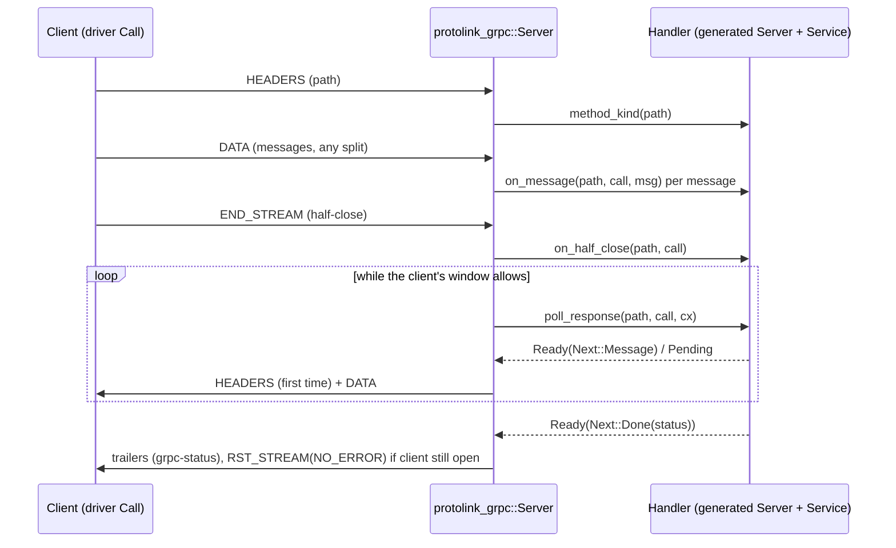

# gRPC Streaming Support: Gap Analysis and Implementation Record

## Scope

This document treats “full gRPC streaming” as supporting all three streaming RPC shapes in addition to unary RPCs:

- **Server-streaming:** one request, zero or more responses.
- **Client-streaming:** zero or more requests, one response after the client half-closes.
- **Bidirectional streaming:** zero or more requests and responses, independently flowing until either side closes.

This scope is specifically about streaming RPCs. It does not imply support for other currently unsupported gRPC features such as custom metadata, reflection, health checking, or TLS. Deadlines are covered separately in [DEADLINES.md](DEADLINES.md).

## Current state (2026-10-02)

**Status: done.** All four RPC shapes are implemented across the HTTP/2 layer (§0), the gRPC runtime (§1–§4), the code generator (§5) and the async/blocking drivers (§6), and the acceptance criteria are covered by tests (see [Acceptance criteria](#acceptance-criteria)). Remaining limitations are listed in [Known limitations](#known-limitations).

`protolink-http2` was not changed after the prerequisites in §0 were added. Everything else was built on its public API.

Unary APIs remain source-compatible:

- `Handler` gained streaming methods with default bodies, so unary handlers (including `FnHandler` and hand-written ones) compile unchanged.
- Generated unary trait methods, `<Service>Server(pub S)`, and the unary client methods keep their signatures.
- Generated streaming trait methods have default `UNIMPLEMENTED` bodies, as tonic's generator does, so adding a streaming RPC to a `.proto` doesn't break existing implementations.

The tonic reference generator (`ref/grpc_rust_generator.cc`) was used for naming and default-body patterns only. Its `async fn` traits with `Send + Sync` bounds and channel-based call builders don't fit protolink's executor-agnostic `no_std + alloc` design, so protolink uses a poll-based handler interface instead (§2).

### Design summary

- **Calls** are identified by `CallId` (the HTTP/2 stream id), unique per connection. Handlers keep per-call state keyed by it.
- **Responses are pulled** with `poll_response(…, &mut Context)` and follow the `Future` contract: on `Pending`, wake `cx.waker()` when a response may be ready. The server also re-polls after delivering requests or the half-close, so only external events need a wake-up.
- **Requests are pushed** with `on_message` and `on_half_close`, in order. Bidi calls are polled from the start. Server- and client-streaming calls are polled once the half-close has been delivered.
- **Calls end** when the handler returns an error from `on_message`/`on_half_close` or `Next::Done` from `poll_response`. Every other ending (peer reset, malformed or oversized request, cardinality violation, connection failure, `Server::cancel_all`) calls `on_cancel`, so the handler can release state.
- **Clients** expose `send`, `close_send` and `message() -> Result<Option<Vec<u8>>, Status>` per call. `Ok(None)` is a clean end and `Err` is the final status, delivered after all received messages and repeated on later calls. Dropping an unfinished call cancels it (`RST_STREAM(CANCEL)`).
- **Memory is bounded** by flow control on both sides (`FlowControl::Manual` is now the default for `ServerConfig` and `ClientConfig`): inbound credit is withheld for complete messages the application hasn't taken yet, and producers are paused while their output waits for the peer's window.

## Gaps by layer

### 0. HTTP/2 prerequisites (done)

These gaps were in `protolink-http2/src/lib.rs` and couldn't be worked around from the gRPC layer without re-parsing HTTP/2 frames. They are now closed with additive APIs. Existing callers that use `Config::default()` (or `..Config::default()`) and match on `Event` are unaffected.

**A. Send-side backpressure visibility.** `Connection::send_data` still never blocks: data beyond `min(conn_send_window, stream.send_window)` stays queued inside the `Connection`, and that queue has no size limit of its own. The connection now exposes the queue so the runtime can apply a limit:

- `queued_send_bytes(id) -> Option<usize>` returns body bytes queued on the stream that have not yet been framed into `pending_output()`.
- `send_capacity(id) -> Option<usize>` returns how many more body bytes could be written immediately under the current stream and connection windows. It is `Some(0)` once the stream is closed for sending. Because the connection window is shared, it is an upper bound when several streams are sending.
- `poll_send_ready() -> Option<StreamId>` returns streams whose queued data shrank because the peer granted credit (WINDOW_UPDATE or SETTINGS) during `recv`. Only streams that can still send are reported, and each is reported at most once per `recv`. Calls to `send_data` from the application never produce entries.

This is a polling method rather than an `Event` variant, because `protolink-grpc` matches `Event` exhaustively and a new variant would break it.

*How the gRPC layer should use it:* after `send_data`, compare `queued_send_bytes` with a per-call high-water mark (for example one maximum-size message). Above the mark, stop taking messages from a server-streaming handler, or keep a client `send` pending. After each `recv`, drain `poll_send_ready` and resume producers whose queue has fallen below the mark.

**B. Application-controlled receive flow control.** `Config` has two new fields:

- `flow_control: FlowControl`. The default is `FlowControl::Automatic`, which keeps the old behaviour of crediting every DATA frame back to the peer immediately. `FlowControl::Manual` is opt-in.
- `connection_window_size: u32`. The default is 65 535. Larger values are announced with a connection-level WINDOW_UPDATE right after the initial SETTINGS.

In `FlowControl::Manual` mode:

- Receive windows are tracked per stream and per connection. A stream's window follows the peer's view: the default 65 535 until our SETTINGS are acknowledged, then `initial_window_size`, with the difference applied to existing streams.
- Bytes delivered in `Event::Data` are credited back only when the application calls `release_capacity(id, n)`. `unreleased_recv_bytes(id)` reports how many delivered bytes a stream still holds.
- Overrunning a stream window resets only that stream with `FLOW_CONTROL_ERROR`. Overrunning the connection window is a connection error with `FLOW_CONTROL_ERROR`.
- Bytes the application never sees are credited back automatically. This covers padding, DATA on closed or reset streams, and DATA discarded after `reset_stream_after_flush`. Any capacity a stream still holds when it closes or is reset is also returned. A stream that is abandoned or finishes therefore can't permanently consume connection credit. After that point, `release_capacity` on the stream is a no-op.

*How the gRPC layer should use it:* enable `FlowControl::Manual` for streaming. Call `release_capacity` when the application consumes a decoded message, not when DATA arrives. This bounds unconsumed inbound data per call to about `initial_window_size`, without stopping transport reads, so other streams and outbound WINDOW_UPDATEs keep flowing. A message larger than the stream window can only arrive if the decoder releases its bytes as it buffers them. Per-call buffering is therefore bounded by `max(initial_window_size, max_message_size)`. Set `connection_window_size` to at least `max_concurrent_streams * initial_window_size`, so that one stream whose data isn't consumed can't starve the others. `release_capacity` sends WINDOW_UPDATEs on every call, so release once per consumed message rather than per DATA event.

**C. Close after flush.** `reset_stream` still writes RST_STREAM immediately and discards queued data. `reset_stream_after_flush(id, code)` defers the RST_STREAM until all queued DATA and trailers have been written. This is the RFC 9113 §8.1 case of a server that finishes a client-streaming or bidi call before the client half-closes:

- If nothing is queued, the stream is reset immediately.
- If the stream closes normally first (the peer sends `END_STREAM`), no RST_STREAM is sent.
- Until the reset fires, `send_data`/`send_headers` fail with `StreamClosed`, `send_capacity` is `Some(0)`, and further DATA from the peer is discarded instead of reported.
- `Event::Reset` is emitted when the RST_STREAM is actually sent. Calling `reset_stream` aborts immediately, for example to give up on a peer that never grants window credit.

*How the gRPC layer should use it:* when a handler completes before request `END_STREAM`, send the trailers with `end_stream = true`, then call `reset_stream_after_flush(id, ErrorCode::NoError)`.

**Tests in `protolink-http2/src/tests.rs`:**

- Queued-bytes and send-capacity accounting across WINDOW_UPDATEs, and `poll_send_ready` reporting (`queued_send_bytes_track_window_updates`, `send_ready_not_reported_after_local_close`).
- Automatic mode unchanged, with `release_capacity` as a no-op (`automatic_flow_control_is_unchanged`).
- Manual mode tests:
  - Data waits for release (`manual_flow_control_waits_for_release`).
  - A stream overrun resets only that stream (`manual_flow_control_stream_overrun_resets_stream`).
  - A connection overrun is a connection error (`manual_flow_control_connection_overrun_is_connection_error`).
  - Streams don't block each other (`manual_flow_control_does_not_block_other_streams`).
  - Credit is returned on reset (`manual_flow_control_returns_connection_credit_on_reset`).
  - Padding is credited back (`manual_flow_control_credits_padding`).
  - The initial window size is applied when our SETTINGS are acknowledged (`manual_flow_control_applies_initial_window_on_settings_ack`).
- Deferred reset tests:
  - All DATA and trailers arrive before `RST_STREAM(NO_ERROR)` (`trailers_delivered_before_deferred_reset`).
  - The reset is immediate when nothing is queued (`deferred_reset_with_nothing_queued_is_immediate`).
  - The reset is skipped when the stream closes normally (`deferred_reset_skipped_when_stream_closes_normally`).

### 1. Message framing and buffering (done)

`protolink-grpc/src/lpm.rs` has an incremental `Decoder` (`push`, `next`, `has_next`, `message_count`, `complete_len`, `buffered`, `error`, `finish`):

- Prefixes and payloads may be split across any number of DATA events, and one DATA event may carry several messages.
- `finish` tells a clean end-of-stream apart from a truncated prefix or payload (`INTERNAL`).
- The per-message limit is enforced from the prefix, before the payload is buffered (`RESOURCE_EXHAUSTED`).
- Compressed messages are still rejected (`UNIMPLEMENTED`).

`decode_unary` is unchanged for single messages. It now reports a second message as `INTERNAL`, as gRPC requires for unary cardinality violations.

The private `inbound.rs` wraps the decoder with manual flow control. Credit is withheld only for complete messages the application hasn't taken yet. Bytes of a partial message are released while no complete message is waiting, so a message larger than the window can still arrive. Per-call inbound buffering is therefore bounded by about `initial_window_size + max_message_size`, not by the total bytes exchanged over the call.

### 2. Server-side call lifecycle and API (done)

`Handler` (`protolink-grpc/src/handler.rs`) gained methods with default bodies:

| Method | Purpose |
|---|---|
| `method_kind(path) -> Option<MethodKind>` | Declares streaming paths. `None` or `Unary` paths keep using `call`. |
| `on_message(path, call, &[u8]) -> Result<(), Status>` | One request message, in order. |
| `on_half_close(path, call) -> Result<(), Status>` | The client sent its last message. |
| `poll_response(path, call, cx) -> Poll<Next<Vec<u8>>>` | Pull the next response or the final status. |
| `on_cancel(path, call)` | The call ended without the handler finishing it. |

- Tuple handlers route streaming calls to the first element whose `method_kind` knows the path. `FnHandler` is unary-only.
- `Server` keeps per-call state until the call ends. New APIs: `poll(handler, cx)`, `cancel_all(handler)`, `active_calls()`, `buffered_request_bytes(id)`, `queued_response_bytes(id)`. `recv` keeps its signature.
- Cardinality is enforced before the handler sees a violation:
  - A server-streaming call needs exactly one request. Otherwise it fails with `INTERNAL` and the handler gets `on_cancel`.
  - A unary call with two messages fails with `INTERNAL`.
  - A client-streaming call completes OK after its first `Next::Message`, and `Next::Done(Ok)` without a message is `INTERNAL`.
- **Backpressure.** A call isn't polled while its earlier responses still wait for the client's window (`queued_send_bytes > 0`) or while too much output is waiting for the transport. Bidi requests are delivered one at a time, interleaved with response polls, and only when the call isn't backed up. A handler that answers each request therefore never accumulates more than about one request's worth of pending replies, however fast the client sends.
- Only HEADERS on a stream id above the last accepted one start a call, so request trailers and late frames can't restart a finished call.

### 3. Client-side call lifecycle and API (done)

`protolink_grpc::Client` (`client.rs`):

- `start_unary`/`take_response` keep the unary path.
- `start_streaming(path)`, `send_message`, `close_send`, `can_send`, `try_next(id) -> Option<Next<Vec<u8>>>`, `is_pending`, `cancel`, `fail_all`, `buffered_response_bytes`, `queued_request_bytes`.
- Zero response messages followed by `grpc-status: 0` is a successful empty stream. Trailers-only responses are handled.
- The terminal status is kept until every received message has been taken. Half-close is separate from cancellation.
- Peer resets map to their gRPC code (`CANCEL` → `CANCELLED`). Transport failure (`fail_all`) is `UNAVAILABLE`.
- Messages sent after the server finished the call are discarded silently. The outcome is reported by the response side, as in other gRPC implementations.
- When trailers arrive while the client is still sending, its side is reset with `NO_ERROR`.
- `can_send` is false while earlier requests wait for the server's window, so producers can be paused.

**Concurrency decision:** the core client supports any number of concurrent calls on one connection (tested), and so do the async and blocking high-level clients (§6). The transport is used by one operation at a time; see [Known limitations](#known-limitations).

### 4. Response status, trailers, errors, and cancellation (done)

- Each call emits exactly one final `grpc-status` block with `END_STREAM`.
- Response headers are sent with the first message, or as soon as the handler returns `Poll::Pending`. Without that, h2/tonic-style clients that wait for headers before streaming requests could stall. A call that fails before either gets a trailers-only response.
- Errors after messages are sent as trailers behind the messages already queued.
- A server that finishes before the client half-closes sends its trailers, then `reset_stream_after_flush(NO_ERROR)`. Window-blocked messages and the status are delivered first.
- Peer resets, malformed requests, cardinality errors, connection failure and `cancel_all` release the call's codec state and call `on_cancel`. Handler-driven endings don't.
- Locally initiated `Event::Reset`s (deferred closes) are recognised and don't trigger `on_cancel`.

### 5. Code generation (done)

`protolink-grpc-gen` emits bindings for all four shapes. For an RPC `Foo` (`foo`):

| Shape | Trait methods (streaming ones default to `UNIMPLEMENTED`) | Client method |
|---|---|---|
| unary | `foo(req) -> Result<Resp, Status>` (required) | `foo(&req) -> Result<Resp, Status>` |
| server streaming | `foo(call, req)`, `poll_foo(call, cx) -> Poll<Next<Resp>>`, `cancel_foo(call)` | `foo(&req) -> ServerStreaming` (request sent and half-closed) |
| client streaming | `foo(call, req)` per message, `poll_foo(call, cx) -> Poll<Result<Resp, Status>>`, `cancel_foo(call)` | `foo() -> ClientStreaming` (`send`, `finish`) |
| bidi | `foo(call, req)` per message, `end_foo(call)` (default `Ok`), `poll_foo(call, cx) -> Poll<Next<Resp>>`, `cancel_foo(call)` | `foo() -> BidiStreaming` (`send`, `close_send`, `message`) |

- The generated `<Service>Server` implements `method_kind`, `on_message`, `on_half_close`, `poll_response` and `on_cancel`, with typed decode/encode through `codec::{message, poll_stream, poll_single}`.
- Its unary `call` answers streaming paths with `UNIMPLEMENTED` ("is a streaming method"), as a safeguard.
- Clients have separate `impl` blocks: `T: UnaryTransport` for unary methods and `T: StreamingTransport` for streaming ones. Blocking clients use `BlockingUnaryTransport`/`BlockingStreamingTransport` and the `Blocking*` wrappers. The wrappers are separate types because inherent methods with the same name can't be split across differently bounded `impl`s.
- Generated names that collide (for example RPCs `Feed` and `PollFeed`) are reported as `Error::Parse` instead of producing code that doesn't compile.
- `METHODS` lists every method path.

### 6. Async and blocking drivers (done)

`protolink/src/asynch.rs` and `blocking.rs`:

- **`serve`** drives `Server::poll` with the serving future's waker, racing it against the transport read, so handlers woken from other tasks or interrupts get their responses written.
  - This requires a cancel-safe `read` when handlers return `Pending`. tokio streams, `CobsFramed` and the `link` stack are cancel-safe. Unary-only servers never drop a read.
  - On exit, every active call is cancelled (`cancel_all`).
- **Blocking `serve`** polls with a no-op waker before every read.
  - `ErrorKind::TimedOut`/`Interrupted` read errors are treated as idle ticks, so a transport read timeout keeps `Pending` streams moving.
  - std's `WouldBlock` maps to `ErrorKind::Other` in `embedded-io` and must be remapped by the adapter. This is documented.
- **`blocking::serve_wakeable`** serves a transport that can wait for input *or* a wake-up, so `Pending` handlers progress without peer traffic and without read timeouts.
  - The transport implements `WakeableRead`: `wake_handle() -> WakeHandle` and `read_or_wake(buf) -> Result<Option<usize>, _>`. `Ok(None)` means woken. The driver turns the `WakeHandle` into the `Waker` handlers get in `poll_response`.
  - The transport owns the latch. A wake that arrives while the server is polling or writing (no read in progress) makes the next `read_or_wake` return `Ok(None)` at once, so the driver needs no flag of its own and cannot lose a wake between its last poll and the wait. Wakes may coalesce and may be spurious. A wake is never end of stream.
  - `serve` and `serve_wakeable` share one loop; `serve` passes a no-op waker and `|io, buf| io.read(buf).map(Some)`. Timed-out and interrupted reads are idle ticks in both.
  - The new items need pointer-sized atomics (`Arc`), so they are gated with `#[cfg(target_has_atomic = "ptr")]`. Targets without them keep `serve` and the timeout fallback.
  - Tests: `protolink/tests/blocking_wake.rs` (server on a thread over a channel transport; `wake_during_poll_is_not_lost` fails if the latch is missing).
- **`Client::streaming(path) -> Call`**, also exposed through `StreamingTransport` and `BlockingStreamingTransport`:
  - Several calls can be active at once; each is routed by its HTTP/2 stream ID. `StreamingTransport::start`, `BlockingStreamingTransport::start` and the generated streaming methods take `&self`; unary calls take `&mut self`, so they can't run while a `Call` exists.
  - The async client keeps its state behind a short-lived lock (a `Mutex` with `std`, a `RefCell` without) that is never held across an await. The transport is checked out for each I/O step and returned by a guard, also when the future is dropped. With `std` the client is `Sync` for a `Send` transport, so calls can be driven from spawned tasks.
  - Operations of different calls serialize on the transport. Every operation first writes all pending output (also other calls'), then reads. When a call has output to write while another operation is in a pending read, a flag and the reader's waker make that read yield: the read future is **dropped**, so the transport `read` must be cancel-safe (as for `serve` with `Pending` handlers). Dropping a call asks a reader to flush the cancellation the same way. A client with one call never drops a read. Every release of the transport wakes all waiting operations, which re-check their own condition first.
  - The blocking client has no lock or check-out (nothing is awaited) and is never `Sync`. It can't interrupt a blocking read.
  - `inner()` was replaced by `with_inner(|client| ...)`.
  - `send` waits while earlier requests wait for the server's window, reading responses meanwhile. They stay buffered up to the call's window.
  - `message` reads until the next message or the end.
  - Dropping an unfinished `Call` cancels only that call, and the connection stays usable.

## Known limitations

- **Concurrent calls need a cancel-safe `read` (async client).** Calls on one connection share the transport; a pending read is dropped when another call must write. tokio streams, `CobsFramed` and the `link` stack are cancel-safe. A transport that loses data when a `read` is dropped (for example a one-shot DMA UART) must go behind `link::pump`, or be used with one call at a time.
- **The blocking client can't interrupt a read.** A `message()` blocks until its own call has something to return. Send on every call the peer waits for before blocking on a response.
- **Unary calls and streaming calls don't overlap.** Unary calls take `&mut self`, so they can't run while a `Call` exists.
- **The drivers don't read while a transport write is blocked.** On a transport that buffers less than the data in flight, a bidi call that sends many requests without reading responses can block both peers in `write`. This affects tiny pipes or UART buffers without a reader task. HTTP/2 flow control bounds memory but not transport-level write blocking. The workaround is to interleave `message` with `send`, or give the transport enough buffering. This is documented on `Call`, and the e2e COBS test uses a 4 KiB pipe for this reason.
- **Unclassified paths are answered at `END_STREAM`.** A handler that can't enumerate its paths (`FnHandler`, or hand-written handlers serving paths through `call`) keeps the default `Handler::is_unknown_method`, which returns `false`. The server then treats an unrecognized path as unary and sends `UNIMPLEMENTED` once the client half-closes, so a client streaming to such a path learns about it only when it finishes sending. Generated `*Server` wrappers know all their paths and answer unknown ones as soon as the request headers arrive; a tuple of handlers does so only if every member does.
- **Deadlines need a cancel-safe `read` too.** With a timer, a driver drops its pending `read` when a deadline is reached, so `serve_with_timer` and clients built with `with_timer` have the same requirement as streaming handlers, even for unary-only servers. See [DEADLINES.md](DEADLINES.md).
- **Blocking `serve` and `Pending` handlers.** With plain `serve`, Pending streams progress only when a read returns or times out. A transport that implements `WakeableRead` and is served with `serve_wakeable` doesn't have this limitation (see §6). The crate ships no wakeable adapter for std sockets: one needs an OS mechanism to wait on the socket and a wake source together (a self-pipe or `eventfd` with `poll`, `mio`, ...).

## Acceptance criteria

All criteria are covered. `protolink-grpc/src/tests_streaming.rs` holds the sans-IO tests, `protolink/tests/h2_interop.rs` the `h2` interop tests, and `examples/embedded-device/tests/e2e.rs` the generated-code end-to-end tests.

| Criterion | Tests |
|---|---|
| All four RPC shapes | `server_streaming_multiple_messages`, `client_streaming_with_zero_and_many_requests`, `bidi_messages_flow_independently`, `unary_and_streaming_share_a_connection`; interop `h2_client_server_streaming`, `h2_client_client_streaming`, `h2_client_bidi_streaming`, `protolink_streaming_client_against_h2_server`; e2e `async_streaming_over_duplex`, `blocking_streaming_over_tcp`, `streaming_over_cobs_framing`; CI `grpcurl-interop` job exercises unary, server-streaming, client-streaming and bidi RPCs against the example server |
| Empty streams, many messages both ways | `server_streaming_empty_stream_is_ok`, `bidi_empty_in_both_directions`, `client_streaming_with_zero_and_many_requests`; interop and e2e empty-stream cases |
| Split prefixes/payloads, several messages per DATA | `decoder_handles_every_split_point`, `decoder_handles_byte_by_byte_and_batched_input`, `messages_split_across_and_batched_in_data_events`; interop byte-per-frame and batched frames in both directions |
| Final status/trailers, errors before/after messages | `error_before_messages_is_trailers_only`, `error_after_messages_uses_trailers`, `error_after_messages_keeps_the_messages`, `handler_error_on_request_ends_the_call`, `client_streaming_without_response_is_internal`, `server_streaming_requires_exactly_one_request`, `unary_with_two_requests_is_internal`, `unknown_streaming_method_is_unimplemented`, `unknown_method_is_answered_before_half_close`, `unknown_method_is_a_trailers_only_response`, `unknown_unary_request_in_one_chunk_is_unimplemented`, `unclassified_path_waits_for_half_close`, `pending_handler_sends_response_headers`; interop `FailLate`/`Repeat [2, 1]` |
| Half-close, cancellation, peer reset, connection failure | `client_cancel_reaches_the_handler`, `server_cancel_all_resets_streams_and_cancels_handlers`, `peer_reset_cancels_the_handler_call`, `connection_failure_cancels_streaming_calls`, `transport_close_cancels_through_fail_all`, `sends_after_the_server_finished_are_discarded`; interop `h2_client_reset_and_disconnect_cancel_calls` and `Reset`/`Drop` client cases; e2e cancel-by-drop with continued use of the connection |
| Size limits, bounded memory under flow control | `decoder_rejects_oversized_message_from_its_prefix`, `oversized_streaming_messages_are_rejected`, `oversized_response_is_rejected_by_client`, `consumer_that_stops_reading_bounds_memory`, `peer_withholding_window_updates_stalls_the_producer`, `bidi_flood_without_reading_is_bounded_on_both_sides` |
| Early finish delivers messages and trailers before reset | `early_finish_delivers_trailers_before_reset`, `early_finish_waits_for_window_before_reset` |
| Concurrent HTTP/2 streams and concurrent client calls | sans-IO: `concurrent_streaming_calls`; interop: several concurrent streams from an h2 client to the protolink server (in `h2_client_against_protolink_server`); driver, deterministic (manual polling, also under Miri): `concurrent_reader_yields_to_a_writer_on_another_call`, `concurrent_waiting_call_is_woken_by_data_read_for_it`, `concurrent_dropping_a_call_makes_the_reader_flush_the_cancel`, `concurrent_abandoned_waiter_does_not_block_the_others`; tokio (`protolink/tests/client_state.rs`): `concurrent_calls_start_and_interleave_on_one_client`, `concurrent_pending_read_does_not_block_another_call_from_sending`, `concurrent_half_close_and_send_get_the_transport_from_a_reader`, `concurrent_tasks_share_one_client` (8 tasks on a multi-thread runtime), `concurrent_dropped_call_does_not_stop_the_others`, `concurrent_peer_disconnect_fails_every_call`; e2e async and blocking clients interleave two bidi calls (`async_streaming_over_duplex`, `blocking_streaming_over_tcp`). CI repeats the `concurrent_*` tests 200 times. |
| Waking from outside the server | `pending_handler_is_polled_again_after_waking`; interop `handler_wakes_server_from_another_task` (tokio task) |
| Generated bindings | `protolink-grpc-gen` tests `generates_streaming_service_methods`, `generates_streaming_routing`, `generates_streaming_clients`, `unary_only_service_has_no_streaming_items`, `rejects_generated_name_collisions` |
| Unary APIs and interop unaffected | the existing unary tests in `protolink-grpc/src/tests.rs`, `h2_client_against_protolink_server`, `protolink_client_against_h2_server`, and the unary e2e tests, all unchanged apart from removing the old "streaming is `UNIMPLEMENTED`" assertion |

The full CI gate includes clippy with `-D warnings`, `fmt --check`, nextest and doctests, the grpcurl interop job, `thumbv7em-none-eabihf` builds with and without `async,blocking`, nightly docs with `-D missing_docs -D rustdoc::broken_intra_doc_links`, and the MSRV 1.88 check.
